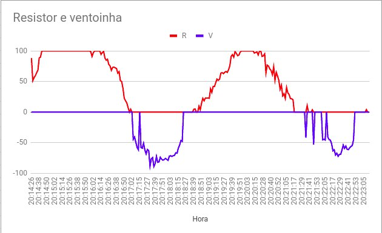

# FSE_projeto1
  Projeto 1 da disciplina de Fundamentos de Sistemas Embarcados (2020/2)

## Descrição
  O objetivo do trabalho é a implementação do controle de temperatura de um sistema que possui dois dispositivos uma resistência e uma ventoinha, para controle de temperatura. O controle deve ser feito com base no valor de controle PID(Proporcional Integral Derivativo).

### Compenentes do Sistema
- Ambiente fechado controlado com o resistor de potência e ventoinha;

- 01 Sensor LM35 para a medição da temperatura interna (TI) do ambiente fechado;
- 01 Sensor BME280 (I2C) para a medição da temperatura externa (TE);
- 01 módulo Display LCD 16x2 com circuito I2C integrado (Controlador HD44780);
- 01 Conversor lógico bidirecional (3.3V / 5V);
Circuito de potência com 2 relés;
- 01 Arduino Micro;
- Potenciômetro;
- Raspberry Pi 4;

  Mais informações: [fse_fga](https://gitlab.com/fse_fga/projetos_2020_2/projeto-1-2020.2)

## Imagens

### Menu

### Graficos
### Entrada Potenciômetro

### Entrada Usuário

## Instruções de Uso

1. Clone o projeto.

        git clone https://github.com/MoacirMSJ/FSE_projeto1.git

2. Entre na pasta
    
        cd FSE_projeto1/projeto1

3. Compile:

        make

4. Execute:

       ./bin/bin

5. Opções
        
        Menu.
          Precione 1 para definir a temperatura.
          Precione 2 para usar dados do potencimetro.

        Atalhos:
          Ctr+z para abrir o menu novamente.
          Ctr+c para finalizar o programa.

### Autor

  **Nome:** Moacir Mascarenha Soares Junior
  
  **Matrícula:** 170080366